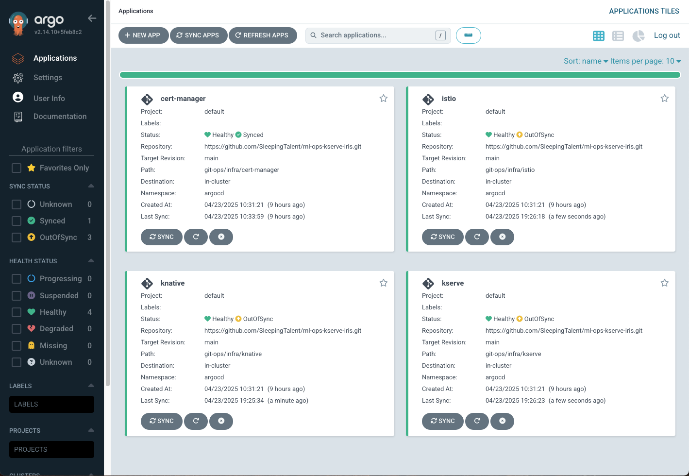
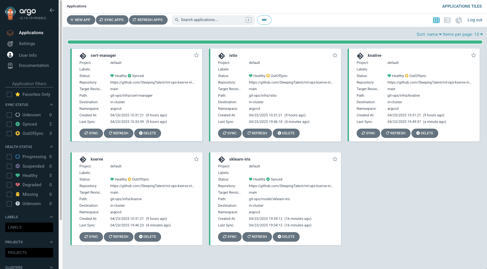
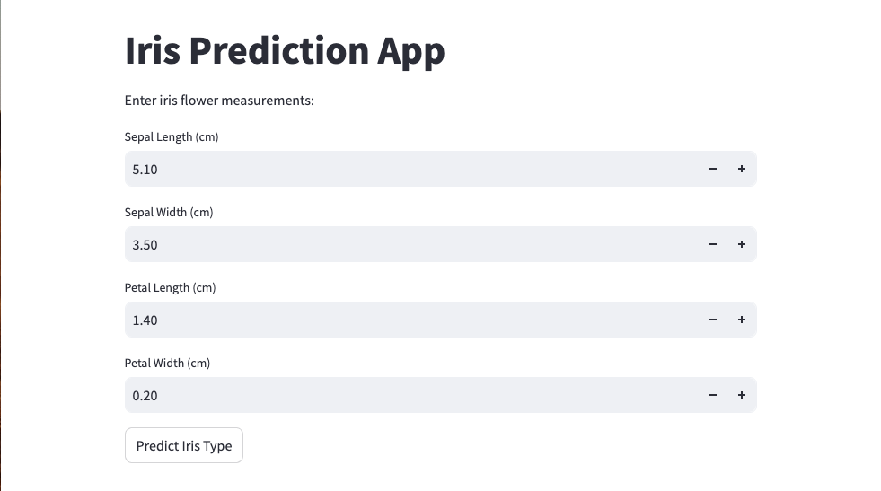

# ml-ops-kserve-iris

# Overview
This is an example demo project demonstrating the use of MiniKube, Argocd and Kserve in ML Ops processes

This project aims to:

* Setup MiniKube locally
* Boostrap the cluster with KServe resources using argoCD
* Deploy a Sklearn-iris model
* Access the model using Streamlit

<details>
<summary>MiniKube Setup</summary>

## Check Minikube is installed

To check that minikube is installed run the following command:
```shell
minkube version
```

If Minikube is installed, you will see the version number printed out, like this:
```shell
minikube version: v1.25.2
```

If the following result is returned then minikube is not installed
```shell
zsh: command not found: minikube
```

### Installing Minikube

Install Minikube with homebrew with the following command:
```shell
brew install minikube
```

## Check Minikube is running

To ensure minikube us running run the following command:
```shell
minikube status
```

If the result is as follows the minikube needs to be started:
```shell
~ % minikube status
minikube
type: Control Plane
host: Stopped
kubelet: Stopped
apiserver: Stopped
kubeconfig: Stopped
```

## Starting Minikube

To start Minikube run the commands below

```shell
minikube start --addons=dashboard
```
<details>
<summary>Add additional nodes (optional)</summary>

### Add additional nodes and labels 

```shell
minikube node add
```

Check nodes

```shell
kubectl get nodes
```

Label Nodes
```shell
kubectl label nodes minikube nodegroup=infra
kubectl label nodes minikube-1 nodegroup=application
kubectl label nodes minikube-2 nodegroup=model
```
</details>

## Stopping Minikube Cluster

```shell
minikube stop
```

## Deleting or Resetting Minikube

```shell
minikube delete
```
</details>

# Deploy the ML Ops Platform
To deploy the ML Ops platform from the root of the repo run the following command:

```shell
./bootstrap-cluster.sh start-platform
```

**What does this command do?**

Starts a fresh minikube instance by running the following commands:

```shell
print_info "Resetting Minikube..."
minikube delete
minikube start
print_info "Minikube started..."
```

it then deploys ArgoCD by running the following:

```shell
deploy_argocd() {
  print_info "Deploying argo cd to cluster..."
  kubectl apply -k ./argocd

  check_pods_ready "argocd" "app.kubernetes.io/name=argocd-server" "argocd-server" "5s" "15"
  check_pods_ready "argocd" "app.kubernetes.io/name=argocd-applicationset-controller" "argocd-applicationset-controller" "5s" "15"
  check_pods_ready "argocd" "app.kubernetes.io/name=argocd-repo-server" "argocd-repo-server" "5s" "15"
  check_pods_ready "argocd" "app.kubernetes.io/name=argocd-application-controller" "argocd-application-controller" "5s" "15"
  check_pods_ready "argocd" "app.kubernetes.io/name=argocd-redis" "argocd-redis" "5s" "15"
}
```

**deploy_argocd()** installs Argo CD via Kustomize and then waits until each of its keys pods is running and ready.

It then exposes argocd via minikube service command:

```shell
print_info "Exposing argocd..."
minikube service argocd-server -n argocd &
print_info "ArgoCD username:admin password:admin"
```

It then deploys the ML Ops Platform by running the following:

```shell
deploy_platform() {
  print_info "Deploying platform components to cluster..."
  kubectl apply -f ./git-ops/infra/bootstrap-platform.yaml

  check_pods_ready "cert-manager" "app.kubernetes.io/instance=cert-manager" "cert-manager" "10s" "15"
  check_pods_ready "istio-system" "app=istiod" "istio" "10s" "15"
  check_pods_ready "istio-system" "app=istio-ingressgateway" "istio" "10s" "15"
  check_pods_ready "knative-serving" "app=controller" "knative" "10s" "15"
  check_pods_ready "kserve" "control-plane=kserve-controller-manager" "kserve" "10s" "15"
  print_info "All platform components are ready!"
}
```

**deploy_platform()** installs platform dependencies (cert-manager, Istio, Knative, KServe) by applying an ArgoCD ApplicationSet. It then waits for pods in each namespace to become Ready, ensuring that the entire MLOps stack is up and running.

<details>
<summary>Example Output</summary>

```shell
ml-ops-kserve-iris % ./bootstrap-cluster.sh start_platform
[INFO] Starting Bootstrap...
[INFO] Resetting Minikube...
🔥  Deleting "minikube" in docker ...
🔥  Deleting container "minikube" ...
🔥  Removing /Users/jamesfairbairn/.minikube/machines/minikube ...
💀  Removed all traces of the "minikube" cluster.
😄  minikube v1.34.0 on Darwin 14.4 (arm64)
🎉  minikube 1.35.0 is available! Download it: https://github.com/kubernetes/minikube/releases/tag/v1.35.0
💡  To disable this notice, run: 'minikube config set WantUpdateNotification false'

✨  Automatically selected the docker driver
📌  Using Docker Desktop driver with root privileges
👍  Starting "minikube" primary control-plane node in "minikube" cluster
🚜  Pulling base image v0.0.45 ...
🔥  Creating docker container (CPUs=2, Memory=9200MB) ...
🐳  Preparing Kubernetes v1.31.0 on Docker 27.2.0 ...
    ▪ Generating certificates and keys ...
    ▪ Booting up control plane ...
    ▪ Configuring RBAC rules ...
🔗  Configuring bridge CNI (Container Networking Interface) ...
🔎  Verifying Kubernetes components...
    ▪ Using image gcr.io/k8s-minikube/storage-provisioner:v5
🌟  Enabled addons: default-storageclass, storage-provisioner
🏄  Done! kubectl is now configured to use "minikube" cluster and "default" namespace by default
[INFO] Minikube started...
[INFO] Minikube status...
minikube
type: Control Plane
host: Running
kubelet: Running
apiserver: Running
kubeconfig: Configured

[INFO] Deploying platform...
[INFO] Deploying argo cd to cluster...
# Warning: 'patchesStrategicMerge' is deprecated. Please use 'patches' instead. Run 'kustomize edit fix' to update your Kustomization automatically.
namespace/argocd created
customresourcedefinition.apiextensions.k8s.io/applications.argoproj.io created
customresourcedefinition.apiextensions.k8s.io/applicationsets.argoproj.io created
customresourcedefinition.apiextensions.k8s.io/appprojects.argoproj.io created
serviceaccount/argocd-application-controller created
serviceaccount/argocd-applicationset-controller created
serviceaccount/argocd-dex-server created
serviceaccount/argocd-notifications-controller created
serviceaccount/argocd-redis created
serviceaccount/argocd-repo-server created
serviceaccount/argocd-server created
role.rbac.authorization.k8s.io/argocd-application-controller created
role.rbac.authorization.k8s.io/argocd-applicationset-controller created
role.rbac.authorization.k8s.io/argocd-dex-server created
role.rbac.authorization.k8s.io/argocd-notifications-controller created
role.rbac.authorization.k8s.io/argocd-redis created
role.rbac.authorization.k8s.io/argocd-server created
clusterrole.rbac.authorization.k8s.io/argocd-application-controller created
clusterrole.rbac.authorization.k8s.io/argocd-applicationset-controller created
clusterrole.rbac.authorization.k8s.io/argocd-server created
rolebinding.rbac.authorization.k8s.io/argocd-application-controller created
rolebinding.rbac.authorization.k8s.io/argocd-applicationset-controller created
rolebinding.rbac.authorization.k8s.io/argocd-dex-server created
rolebinding.rbac.authorization.k8s.io/argocd-notifications-controller created
rolebinding.rbac.authorization.k8s.io/argocd-redis created
rolebinding.rbac.authorization.k8s.io/argocd-server created
clusterrolebinding.rbac.authorization.k8s.io/argocd-application-controller created
clusterrolebinding.rbac.authorization.k8s.io/argocd-applicationset-controller created
clusterrolebinding.rbac.authorization.k8s.io/argocd-server created
configmap/argocd-cm created
configmap/argocd-cmd-params-cm created
configmap/argocd-gpg-keys-cm created
configmap/argocd-notifications-cm created
configmap/argocd-rbac-cm created
configmap/argocd-ssh-known-hosts-cm created
configmap/argocd-tls-certs-cm created
secret/argocd-notifications-secret created
secret/argocd-secret created
secret/ml-ops-kserve-repo created
service/argocd-applicationset-controller created
service/argocd-dex-server created
service/argocd-metrics created
service/argocd-notifications-controller-metrics created
service/argocd-redis created
service/argocd-repo-server created
service/argocd-server created
service/argocd-server-metrics created
deployment.apps/argocd-applicationset-controller created
deployment.apps/argocd-dex-server created
deployment.apps/argocd-notifications-controller created
deployment.apps/argocd-redis created
deployment.apps/argocd-repo-server created
deployment.apps/argocd-server created
statefulset.apps/argocd-application-controller created
networkpolicy.networking.k8s.io/argocd-application-controller-network-policy created
networkpolicy.networking.k8s.io/argocd-applicationset-controller-network-policy created
networkpolicy.networking.k8s.io/argocd-dex-server-network-policy created
networkpolicy.networking.k8s.io/argocd-notifications-controller-network-policy created
networkpolicy.networking.k8s.io/argocd-redis-network-policy created
networkpolicy.networking.k8s.io/argocd-repo-server-network-policy created
networkpolicy.networking.k8s.io/argocd-server-network-policy created
[WARNING] ⏳ Waiting for argocd-server... Attempt 1/15
[WARNING] ⏳ Waiting for argocd-server... Attempt 2/15
[WARNING] ⏳ Waiting for argocd-server... Attempt 3/15
[WARNING] ⏳ Waiting for argocd-server... Attempt 4/15
pod/argocd-server-78b96b85f8-pclps condition met
[INFO] ✅ argocd-server is ready! (Waited 36s)
pod/argocd-applicationset-controller-696dcc7f6-hmkpv condition met
[INFO] ✅ argocd-applicationset-controller is ready! (Waited 0s)
[WARNING] ⏳ Waiting for argocd-repo-server... Attempt 1/15
pod/argocd-repo-server-c845956c5-csc8c condition met
[INFO] ✅ argocd-repo-server is ready! (Waited 10s)
pod/argocd-application-controller-0 condition met
[INFO] ✅ argocd-application-controller is ready! (Waited 1s)
pod/argocd-redis-5d5c4bb9b5-nghnd condition met
[INFO] ✅ argocd-redis is ready! (Waited 0s)
[INFO] Exposing argocd...
[INFO] ArgoCD username:admin password:admin
[INFO] Deploying platform components to cluster...
applicationset.argoproj.io/ml-ops-kserve-platform created
[WARNING] ⏳ Waiting for cert-manager... Attempt 1/15
|-----------|---------------|-------------|--------------|
| NAMESPACE |     NAME      | TARGET PORT |     URL      |
|-----------|---------------|-------------|--------------|
| argocd    | argocd-server |             | No node port |
|-----------|---------------|-------------|--------------|
😿  service argocd/argocd-server has no node port
❗  Services [argocd/argocd-server] have type "ClusterIP" not meant to be exposed, however for local development minikube allows you to access this !
🏃  Starting tunnel for service argocd-server.
|-----------|---------------|-------------|------------------------|
| NAMESPACE |     NAME      | TARGET PORT |          URL           |
|-----------|---------------|-------------|------------------------|
| argocd    | argocd-server |             | http://127.0.0.1:51894 |
|           |               |             | http://127.0.0.1:51895 |
|-----------|---------------|-------------|------------------------|
[argocd argocd-server  http://127.0.0.1:51894
http://127.0.0.1:51895]
❗  Because you are using a Docker driver on darwin, the terminal needs to be open to run it.
[WARNING] ⏳ Waiting for cert-manager... Attempt 2/15
[WARNING] ⏳ Waiting for cert-manager... Attempt 3/15
[WARNING] ⏳ Waiting for cert-manager... Attempt 4/15
[WARNING] ⏳ Waiting for cert-manager... Attempt 5/15
pod/cert-manager-6794b8d569-jkdfx condition met
[WARNING] ⏳ Waiting for cert-manager... Attempt 6/15
pod/cert-manager-6794b8d569-jkdfx condition met
pod/cert-manager-cainjector-7f69cd69f7-kjz2g condition met
pod/cert-manager-webhook-6cc5dccc4b-gd9bj condition met
[INFO] ✅ cert-manager is ready! (Waited 71s)
[WARNING] ⏳ Waiting for istio... Attempt 1/15
[WARNING] ⏳ Waiting for istio... Attempt 2/15
pod/istiod-5668b4464f-z4jwc condition met
[INFO] ✅ istio is ready! (Waited 30s)
[WARNING] ⏳ Waiting for istio... Attempt 1/15
[WARNING] ⏳ Waiting for istio... Attempt 2/15
[WARNING] ⏳ Waiting for istio... Attempt 3/15
[WARNING] ⏳ Waiting for istio... Attempt 4/15
[WARNING] ⏳ Waiting for istio... Attempt 5/15
pod/istio-ingressgateway-7f6cf75bbc-k5q4l condition met
[INFO] ✅ istio is ready! (Waited 76s)
pod/controller-7cf4fbd94-tz69m condition met
[INFO] ✅ knative is ready! (Waited 0s)
[WARNING] ⏳ Waiting for kserve... Attempt 1/15
pod/kserve-controller-manager-58c9c57c74-fnlp8 condition met
[INFO] ✅ kserve is ready! (Waited 16s)
[INFO] All platform components are ready!
[INFO] Bootstrap completed in 264 seconds
```

</details>

ArgoCD is now exposed on a port locally for example on either the http://127.0.0.1:51894 or http://127.0.0.1:51895 url. 

To login use the username admin and the password admin.

ArgoCD should now show ML Ops Platofrm Components have been installed



# Deploy the Sklearn-Iris Model

To deploy the sklearn-iris model from the root of the repo run the following command:

```shell
./bootstrap-cluster.sh deploy_models
```

**What does this command do?**

It deploys the models by running the following:

```shell
deploy_models() {
  print_info "Deploying models to cluster..."
  kubectl apply -f ./git-ops/model/bootstrap-models.yaml

  check_pods_ready "sklearn-iris" "app.kubernetes.io/instance=sklearn-iris" "sklearn-iris" "20s" "20"
}
```

**deploy_models()** installs models by applying an ArgoCD ApplicationSet. It then waits for pods to become Ready, ensuring that the InferenceService is up and running.

<details>
<summary>Example Output</summary>

```shell
ml-ops-kserve-iris % ./bootstrap-cluster.sh deploy_models
[INFO] Deploying models...
[INFO] Deploying models to cluster...
applicationset.argoproj.io/ml-ops-kserve-models created
[WARNING] ⏳ Waiting for sklearn-iris... Attempt 1/20
pod/sklearn-iris-predictor-00001-deployment-8766fcd58-49vgz condition met
[INFO] ✅ sklearn-iris is ready! (Waited 22s)
```

</details>

**sklearn-iris** should now be deployed and listed in ArgoCD UI



## Smoke Test Sklearn-Iris

We can run a quick smoke test to ensure the model has been deployed correctly.

To run a test against the model run the following command

```shell
./bootstrap-cluster.sh test_models
```

<details>
<summary>Example Output</summary>

```shell
[INFO] Testing model...
[INFO] Retrieving Ingress Gateway Service...
[INFO] Ingress Gateway Service: istio-ingressgateway
[INFO] Starting port-forwarding for Ingress Gateway Service on local port 8081 to target port 80...
[INFO] Port-forward process started with PID 74345
[INFO] Retrieving the service hostname from the sklearn-iris inferenceservice...
[INFO] Service Hostname: sklearn-iris.sklearn-iris.noveria.ai
[INFO] Ingress Host: localhost
[INFO] Ingress Port: 8081
[INFO] Sending prediction request...
*   Trying [::1]:8081...
* Connected to localhost (::1) port 8081
> POST /v1/models/sklearn-iris:predict HTTP/1.1
> Host: sklearn-iris.sklearn-iris.noveria.ai
> User-Agent: curl/8.4.0
> Accept: */*
> Content-Type: application/json
> Content-Length: 130
> 
< HTTP/1.1 200 OK
< content-length: 21
< content-type: application/json
< date: Thu, 24 Apr 2025 09:22:47 GMT
< server: istio-envoy
< x-envoy-upstream-service-time: 13
< 
* Connection #0 to host localhost left intact
{"predictions":[1,1]}
[INFO] Test complete...
```

</details>

# Deploy the Streamlit-Iris-Predictor App

To deploy the streamlit-iris-predictor app from the root of the repo run the following command:

```shell
./bootstrap-cluster.sh deploy_apps
```

**What does this command do?**

It deploys the apps by running the following:

```shell
deploy_apps() {
  print_info "Deploying apps to cluster..."
  kubectl apply -f ./git-ops/app/bootstrap-apps.yaml

  check_pods_ready "sklearn-iris-predictor" "app=streamlit-iris" "sklearn-iris-predictor" "10s" "15"

  print_info "Exposing streamlit-iris-service..."
  minikube service streamlit-iris-service -n sklearn-iris-predictor &
}
```

**deploy_apps()** installs apps by applying an ArgoCD ApplicationSet. It then waits for pods to become Ready, ensuring that the Application is up and running. It then exposes the applications service so it can be accessed locally.

<details>
<summary>Example Output</summary>

```shell
ml-ops-kserve-iris % ./bootstrap-cluster.sh deploy_apps
[INFO] Deploying app...
[INFO] Deploying apps to cluster...
applicationset.argoproj.io/ml-ops-kserve-apps created
[WARNING] ⏳ Waiting for sklearn-iris-predictor... Attempt 1/15
pod/streamlit-iris-7b94db869b-djwst condition met
[INFO] ✅ sklearn-iris-predictor is ready! (Waited 5s)
[INFO] Exposing streamlit-iris-service...
jamesfairbairn@Jamess-MacBook-Pro ml-ops-kserve-iris % |------------------------|------------------------|-------------|--------------|
|       NAMESPACE        |          NAME          | TARGET PORT |     URL      |
|------------------------|------------------------|-------------|--------------|
| sklearn-iris-predictor | streamlit-iris-service |             | No node port |
|------------------------|------------------------|-------------|--------------|
😿  service sklearn-iris-predictor/streamlit-iris-service has no node port
❗  Services [sklearn-iris-predictor/streamlit-iris-service] have type "ClusterIP" not meant to be exposed, however for local development minikube allows you to access this !
🏃  Starting tunnel for service streamlit-iris-service.
|------------------------|------------------------|-------------|------------------------|
|       NAMESPACE        |          NAME          | TARGET PORT |          URL           |
|------------------------|------------------------|-------------|------------------------|
| sklearn-iris-predictor | streamlit-iris-service |             | http://127.0.0.1:58690 |
|------------------------|------------------------|-------------|------------------------|
🎉  Opening service sklearn-iris-predictor/streamlit-iris-service in default browser...
❗  Because you are using a Docker driver on darwin, the terminal needs to be open to run it.
```

</details>

The streamlit application should open in your default browser, if not it can be accessed on in the exposed port for example http://127.0.0.1:58690



## Test Payloads

The Iris Prediction App can be tested with the following payloads to test each Iris type:

Setosa
```shell
{ "instances": [ [5.1, 3.5, 1.4, 0.2] ] }
```

Versicolor
```shell
{ "instances": [ [6.0, 2.9, 4.5, 1.5] ] }
```

Virginica
```shell
{ "instances": [ [6.9, 3.1, 5.4, 2.1] ] }
```

<details>
<summary>Kserve Helm Chart Authentication Workaround</summary>

## KServe Helm Charts

There seems to be an authentication problem with using the KServe helms charts directly with ArgoCD and Kustomize

```shell
oci://ghcr.io/kserve/charts/kserve-crd --version v0.14.1
oci://ghcr.io/kserve/charts/kserve --version v0.14.1
```

A workaround is to pull down these charts locally and reference the local charts in the kustomize file

Add a folder called _charts_ to [Kserve deployment folder](git-ops/infra/kserve) to store the charts locally

In the _charts_ folder run the following commands
```shell
helm pull oci://ghcr.io/kserve/charts/kserve-crd --version v0.14.1 --untar
helm pull oci://ghcr.io/kserve/charts/kserve --version v0.14.1 --untar
```

Update the Kserve [kustomization.yaml](git-ops/infra/kserve/kustomization.yaml)
```yaml
namespace: kserve

resources:
 - namespace.yaml

helmGlobals:
  chartHome: ./charts

helmCharts:
  - name: kserve-crd
#    repo: oci://ghcr.io/kserve/charts/kserve-crd
    version: v0.14.1
    releaseName: kserve-crd
    namespace: kserve
  - name: kserve
#    repo: oci://ghcr.io/kserve/charts/kserve
    version: v0.14.1
    releaseName: kserve
    namespace: kserve
```
</details>